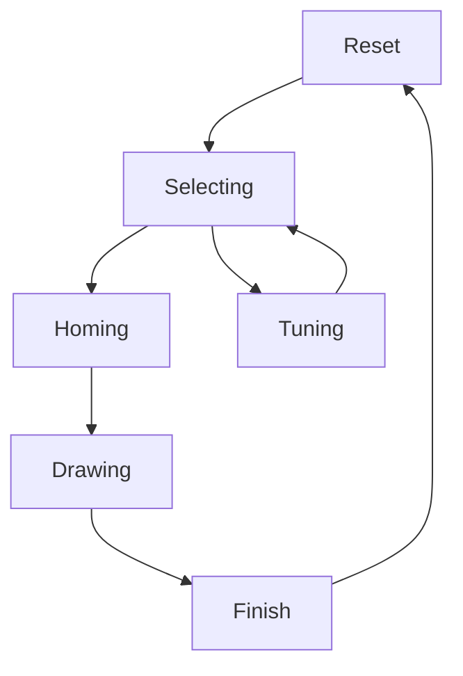

# CNC Etch-A-Sketch

A CNC-controlled Etch-A-Sketch that automatically draws pre-programmed designs using stepper motors. Built with Arduino and PlatformIO.

<center>
    
</center>

## Overview

This project transforms a classic Etch-A-Sketch toy into an automated drawing machine. An Arduino Nano controls two stepper motors (one for each axis) to precisely manipulate the knobs and draw various patterns. Users can select from multiple pre-programmed designs using a potentiometer and trigger the drawing with a button.

## Features

- **Automated Drawing**: Pre-programmed designs executed with precise stepper motor control
- **Drawing Selection**: Choose from multiple designs using a potentiometer slider
- **State Machine Architecture**: Clean separation of concerns with states for selecting, homing, drawing, and finishing
- **LCD Display**: Real-time feedback on the 16x2 I2C LCD display
- **Stepper Calibration**: Built-in tuning mode for backlash compensation stored in EEPROM

## Bill of Materials (BOM)

### General

| Quantity | Component | Description | Link |
|----------|-----------|-------------|-------|
| 1 | Etch-A-Sketch | Classic Etch-A-Sketch toy | [778988609583](https://www.amazon.com/Etch-A-Sketch-Classic-Red/dp/B01N1ZVYDM/) |

### Electronics

| Quantity | Component | Description | Link |
|----------|-----------|-------------|-------|
| 1 | Arduino Nano | ATmega328P microcontroller | [Arduino Nano V3.0](https://www.amazon.com/dp/B09DCV5HRM) |
| 2 | Stepper Motor | 28BYJ-48 or equivalent (200 steps/rev) | [NEMA 17-34MM](https://www.amazon.com/dp/B0CMSYY6MK) |
| 2 | Motor Driver | L298N dual H-bridge driver | [762917148410](https://www.amazon.com/dp/B0C5JCF5RS) |
| 1 | LCD Display | 16x2 LCD module with I2C backpack | [LCD1602](https://www.amazon.com/dp/B08MPTND1V) |
| 1 | Push Button | Momentary tactile switch | [Cylewet SPST](https://www.amazon.com/dp/B0752RMB7Q) |
| 1 | Linear Potentiometer | Linear 10kΩ potentiometer | [a21031100ux0167](https://www.amazon.com/dp/B0993BXDSC) |
| 1 | Power Switch | Rocker switch 2P1T | [KCD1-105-2P](https://www.amazon.com/dp/B07D285PLL) |
| 1 | DC Power Jack | 5.5mm x 2.1mm DC barrel plug | [DC099-20M889B](https://www.amazon.com/dp/B07C46XMPT) |
| 1 | Power Supply | 12V 5A AC to DC power supply | [4342705952](https://www.amazon.com/dp/B07GFFG1BQ) |

### 3D Printed Parts

All STL files are located in the `hardware/` directory.

| Quantity | Part | Filename |
|----------|------|----------|
| 2 | Etch-A-Sketch Gear | `gear_0.stl` |
| 2 | Stepper Motor Gear | `gear_1.stl` |
| 1 | Potentiometer Knob | `knob_potentiometer.stl` |
| 2 | Back Mount | `mount_back.stl` |
| 2 | L298N Driver Mount | `mount_L298N.stl` |
| 1 | LCD Mount | `mount_lcd.stl` |

### Laser Cut Parts

All files are located in the `hardware/` directory.

| Quantity | Part | Filename |
|----------|------|----------|
| 1 | Case Panels | `cnc_etch_a_sketch_case.svg` |

### Hardware (Fasteners)

| Quantity | Component | Description | Link |
|----------|-----------|-----------|-------|
| 10 | Heat-set Inserts | M3 x 4mm | [Assorted knurled threaded inserts](https://www.amazon.com/dp/B07GLJ7KCJ) |
| 10 | Machine Screws | M3 x 6mm | [Assorted Socket Screws](https://www.amazon.com/dp/B014OO5KQG) |
| 8 | Machine Screws | M3 x 10mm (For mounting stepper motors) | [Assorted Socket Screws](https://www.amazon.com/dp/B014OO5KQG) |

### CAD Files

The complete CAD model is available in `hardware/CNC_Etch_A_Sketch.f3d` (Fusion 360 format).

### Pin Connections

**LCD Display (I2C):**
- SDA → A4
- SCL → A5

**Controls:**
- Button → A0
- Potentiometer → A1

**X-Axis Stepper:**
- Pins 8, 7, 6, 5

**Y-Axis Stepper:**
- Pins 12, 11, 10, 9

See `hardware/cnc_etch_a_sketch_wiring_diagram.pdf` and `hardware/EtchASketch.kicad_sch` for the complete wiring diagram and schematic.

## Assembly

### 1. Fabrication

- **3D Printing**: Print all parts from `hardware/*.stl` using PLA or PETG
- **Laser Cutting**: Cut case panels from `hardware/cnc_etch_a_sketch_case.svg` (material: acrylic or wood, thickness: 1/8" (3mm) )
- **Hardware**: Install heat-set inserts into printed parts as needed

### 2. Mechanical Assembly

1. Add heat-set inserts into the holes of all printed parts with a soldering iron.
1. Assemble case by aligning all finger joints, use glue as needed.
1. Mount stepper motors into front panel using screws.
1. Install gears onto stepper motor shafts and Etch-A-Sketch knobs.
1. Glue or epoxy the L298N mounts, LCD mount, and back panel mounts to case panels.
1. Install Arduino Nano, motor drivers, LCD, and controls in respective mounts
1. Follow the wiring diagram in `hardware/cnc_etch_a_sketch_wiring_diagram.pdf` to connect all components.

## Software Requirements

- [PlatformIO](https://platformio.org/) (recommended) or Arduino IDE
- PlatformIO Core (CLI) or PlatformIO IDE extension for VSCode

## Software Setup

### 1. Clone and Install Dependencies

```bash
git clone https://github.com/mathewpwheatley/cnc-etch-a-sketch
cd cnc-etch-a-sketch
pio pkg install
```

### 2. Configure Machine Parameters

Edit `include/config.h` to match your machine dimensions and calibration:

```cpp
constexpr float STEPS_PER_INCH = 140.0f;      // Calibrated steps per inch
constexpr float MACHINE_WIDTH_IN = 6.0f;      // Drawing area width
constexpr float MACHINE_HEIGHT_IN = 4.25f;    // Drawing area height
```

### 3. Build and Upload

```bash
pio run --target upload
```

Or use the PlatformIO IDE upload button.

## Usage

1. **Power On**: The LCD displays "CNC Etch-A-Sketch"
2. **Select Drawing**: Slide the potentiometer to browse available designs
3. **Start Drawing**: Press the button to begin the selected drawing
    1. **Tune Backlash**: Long press the button to enter Tuning mode
    1. **Set Backlash Compensation**: Slide the potentiometer to select the desired compensation and press the button to accept.
4. **Homing**: Manually home to the origin (bottom-left)
5. **Drawing**: Watch as the design is automatically drawn
6. **Finish**: The machine completes and returns to selection mode

### State Flow



Hold the button during operation to interrupt and reset.

## Configuration

### Adding New Drawings

New drawings can be added using the SVG-to-Arduino conversion script:

1. **Create/Add SVG**: Place your SVG file in the `scripts/` directory
   - Keep designs simple - the Arduino Nano has limited memory
   - Use only paths (no fills, gradients, or complex styling)
   - Remember the Etch-A-Sketch can only draw in one continuous line

2. **Run Conversion Script**: Execute the Python script to generate Arduino-compatible code:
   ```bash
   cd scripts
   python svg_to_arduino.py
   ```

3. **Rebuild and Upload**: The script automatically generates `src/drawing/drawing_data.h` with normalized coordinates (0.0 to 1.0). Rebuild and upload the firmware.

**Script Requirements:**
- Python 3
- `svgpathtools` library: `pip install svgpathtools`

The script converts SVG paths into point arrays, normalizes coordinates based on the page dimensions, and handles both straight lines and curves through adaptive sampling.

### Tuning Backlash Compensation

The system includes a tuning state for backlash compensation. Backlash values are stored in EEPROM and persist between power cycles. To use, hold the button for 1 second while in the **Select Drawing** state to enter **Tuning** mode. Use the slide potentiometer to set the desired backlash compensation and press the button again to accept.

### Performance Tuning

Adjust stepper motor parameters in `include/config.h`:

```cpp
constexpr int STEPPER_MAX_SPEED = 1000;           // Steps per second
constexpr int STEPPER_ACCELERATION = 500;         // Steps per second²
```

## Project Structure

```
├── include/
│   └── config.h              # Hardware configuration and constants
├── src/
│   ├── main.cpp              # Entry point
│   ├── Machine.cpp/h         # Main state machine controller
│   ├── drawing/              # Drawing management and data
│   │   └── drawing_data.h   # Generated drawing coordinates (auto-generated)
│   ├── hardware/             # Hardware abstraction (Button, Display, Steppers, Slider)
│   └── state/                # State machine implementations
├── scripts/
│   ├── svg_to_arduino.py     # SVG to Arduino coordinate converter
│   └── *.svg                 # Source SVG drawings
├── hardware/                 # CAD files and fabrication
│   ├── *.stl                 # 3D printable parts
│   ├── *.svg                 # Laser cut files
│   ├── *.f3d                 # Fusion 360 source
│   ├── *.pdf                 # Wiring diagram
│   └── *.kicad_sch           # KiCad schematic
└── platformio.ini            # PlatformIO configuration
```

## Dependencies

- [LiquidCrystal_I2C](https://github.com/marcoschwartz/LiquidCrystal_I2C) (v1.1.4) - I2C LCD control
- [AccelStepper](https://github.com/waspinator/AccelStepper) (v1.64) - Stepper motor acceleration library

## License

This project is licensed under the MIT License, see the [LICENSE](LICENSE) file for details.

## Acknowledgments

Built with Arduino and PlatformIO for precise stepper motor control and clean embedded C++ architecture.
